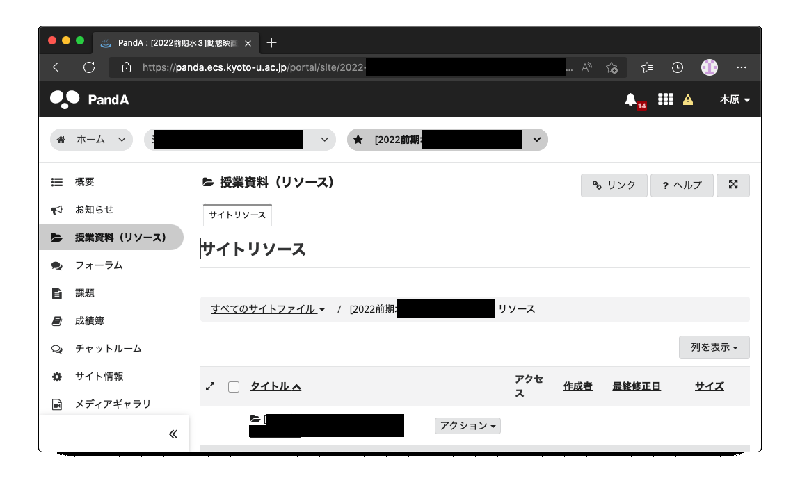
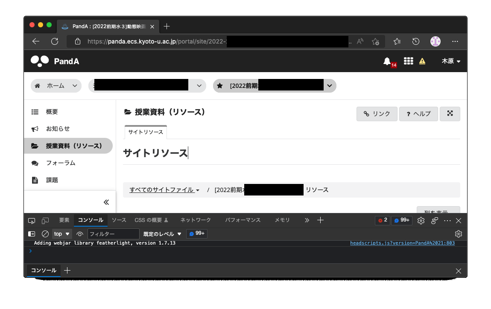
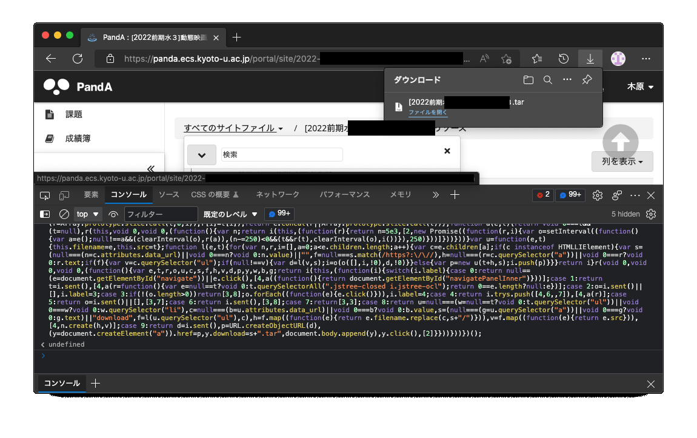

# PandA の授業資料（リソース）を全てダウンロードするスクリプト

PandA (京都大学CMS) の授業資料を .tar ファイルに固めてダウンロードするスクリプト [PandA_download_all_resource.js](./PandA_download_all_resource.js) です。

## 使い方

1. PandA でコースの「授業資料（リソース）」のページに移動する
  
2. キーボードの <kbd>F12</kbd> キーを押し、コンソールを開く
  
3. [PandA_download_all_resource.js](./PandA_download_all_resource.js) の中身を貼り付けて <kbd>Enter</kbd> キーを押す
4. .tar ファイルがダウンロード完了
  

